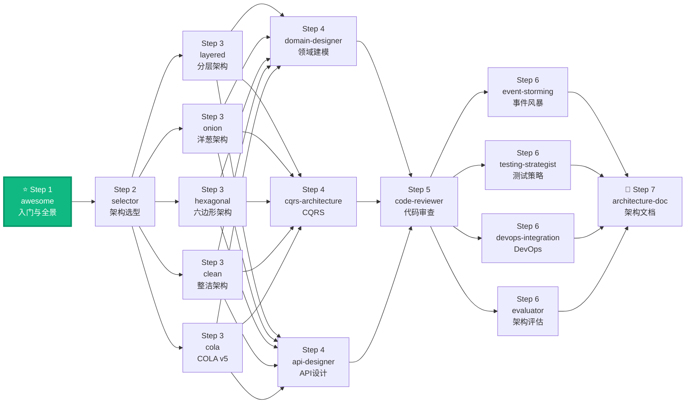

# DDD Architecture Awesome

The **entry point** to the DDD Skills ecosystem. This skill provides everything needed to understand DDD, decide if it's right for your project, and chart your learning path — all in one place.

## When to Use (and When NOT to)

| ✅ Use When | ❌ Skip When |
|------------|-------------|
| Complex business domain with many rules | Simple CRUD, few business rules |
| Long-lived system (years of maintenance) | Prototype, MVP, throwaway code |
| Team of 5+ developers | Solo developer or small team (1-2) |
| Multiple entry points (API, CLI, events) | Single entry point, simple API |
| Need to swap infrastructure (DB, broker) | Fixed infrastructure, unlikely to change |
| High test coverage required | Quick scripts, internal tools |
| Chinese enterprise Spring Boot + MyBatis stack | Already using established architecture that works |

**Start simple. Evolve complexity only when needed.** Most systems don't need full CQRS or Event Sourcing.

## When to trigger this skill

**ALWAYS use this skill when the user mentions:**
- "What is DDD", "Explain DDD", "DDD 是什么", "介绍一下 DDD"
- "Domain-Driven Design", "领域驱动设计"
- "DDD basics", "DDD fundamentals", "DDD 基础", "DDD 入门"
- "Should I use DDD", "DDD 适用场景", "DDD 是否适合"
- "DDD vs CRUD", "DDD vs traditional", "DDD 对比"
- "DDD concepts", "DDD 概念"
- "Strategic design DDD", "Tactical design DDD", "DDD 战略设计", "DDD 战术设计"
- "When to apply DDD", "When DDD is appropriate"
- Questions about DDD architecture types and their differences
- New to DDD and seeking guidance on where to start

---

## 1. DDD Definition

> Domain-Driven Design is a development methodology that brings complex business rules into domain models: first define business boundaries (Strategic Design), then encode rules into models (Tactical Design).

**Key insight**: DDD is not about technology — it's about aligning your code with how the business thinks.

---

## 2. DDD Applicability Decision Tree

**Evaluate along these dimensions and provide a "Suitable / Cautious / Not Recommended" conclusion:**

| Dimension | Suitable (✓) | Cautious (~) | Not Recommended (✗) |
|-----------|-------------|-------------|---------------------|
| **Business Complexity** | Complex rules, state machines, cross-team coordination | Some business rules, mostly simple | Pure CRUD, data entry |
| **Lifecycle** | Long-lived, continuous evolution | Medium-term, some iteration | Short-term, disposable |
| **Team Maturity** | Dedicated domain expert, stable PM | General business knowledge | No domain knowledge |
| **Engineering Capability** | Strong test/observability, event-driven ready | Basic CI/CD, some testing | No testing infrastructure |

### Decision Flowchart

```
Is business logic complex (rules, state machines, constraints)?
├── NO → Is system long-lived (> 2 years)?
│         ├── NO → ✗ DDD NOT RECOMMENDED (Use simple CRUD + Service)
│         └── YES → ~ Cautious: adopt tactical patterns selectively
│
└── YES → Is there a domain expert or stable product owner?
          ├── NO → ~ Cautious: DDD without domain expert = complex code for nothing
          └── YES → Is the team familiar with DDD or willing to learn?
                    ├── NO → ~ Cautious: start with Layered, evolve later
                    └── YES → Do you need to swap infrastructure (DB, MQ)?
                              ├── NO → ✓ DDD RECOMMENDED (COLA or Layered)
                              └── YES → ✓ DDD STRONGLY RECOMMENDED (Hexagonal/Clean)
```

---

## 3. Complexity Ladder — Don't Skip Levels

**Each level adds real complexity. Move up only when you've proven the current level insufficient.**

```
Level 1: Simple Layered (Controller → Service → Repository)
   ↓ When business rules grow complex and need explicit modeling
Level 2: DDD 4-Layer with Rich Domain Model (Layered)
   ↓ When need multiple entry points (REST + CLI + MQ + gRPC)
Level 3: Ports & Adapters (Hexagonal Architecture)
   ↓ When read/write patterns diverge significantly
Level 4: CQRS — Separate Read/Write Models
   ↓ When need complete audit trail / temporal queries
Level 5: Event Sourcing — Store events, derive state

Your project Level: ___ (Recommend with reasoning)
```

---

## 4. Pattern Boundaries — What Each Pattern IS and IS NOT

This table solves the most common DDD confusion: "What's the difference between these patterns, and when should I use each one?"

| Pattern | Primary Question | Use It For | Do NOT Treat As |
|---------|-----------------|------------|-----------------|
| **DDD** | How do we model a complex business domain? | Ubiquitous language, bounded contexts, aggregates, value objects | A folder structure by itself |
| **Hexagonal Architecture** | How does the application interact with the outside world? | Ports, driver adapters, driven adapters, testable application core | A mandate for six sides or one exact package layout |
| **Clean Architecture** | Which direction should dependencies point? | Inward dependency rule, use case boundaries, framework independence | A universal four-folder template |
| **Onion Architecture** | How do we keep the domain model central? | Domain-centered layers and dependency inversion | A separate requirement when Clean/Hexagonal already solve the problem |
| **COLA v5** | How do we standardize DDD in enterprise Java teams? | Diamond architecture, scaffolding, automated architecture validation | A silver bullet for all projects |
| **Layered Architecture** | How do we introduce DDD incrementally? | 4-layer separation, minimal disruption to existing 3-layer projects | A permanent destination (evolve when ready) |
| **CQRS** | Do reads and writes need different models? | Bounded contexts with divergent read/write workloads | A default application architecture |
| **Event Sourcing** | Do we need state from a complete event history? | Audit trails, temporal queries, replayable workflows | A persistence default for CRUD systems |

---

## 5. DDD Architecture Landscape Overview

```
DDD Architecture Family:

  Foundational (Learning cost: Low → Medium):
  ├── Layered Architecture (分层架构)
  │   └── Classic 4-layer: Interface → Application → Domain ← Infrastructure
  │       1-5 people | CRUD-friendly | Spring Boot native
  │
  ├── Onion Architecture (洋葱架构)
  │   └── Domain core, concentric dependency rings, inner defines interface
  │       5-15 people | High testability | Frequent infra changes
  │
  ├── Hexagonal Architecture (六边形架构 / Ports & Adapters)
  │   └── Domain at center, ports define contracts, adapters implement
  │       5-15 people | Multi-entry systems | Best testability
  │
  Advanced (Learning cost: Medium → High):
  ├── Clean Architecture (整洁架构)
  │   └── Entities → Use Cases → Interface Adapters → Frameworks
  │       15-50 people | Enterprise systems | Strict module isolation
  │
  └── COLA Architecture (COLA v5 架构)
      └── Diamond pattern: Adapter → App → Domain ← Infrastructure
          5-50 people | Chinese enterprise | Best tooling & community

  Complementary Patterns:
  ├── CQRS — Separate read/write models (L1: Model only / L2: DB separation / L3: Event Sourcing)
  ├── Domain Events — Cross-aggregate eventual consistency
  └── Event Sourcing — Store events as source of truth
```

### Architecture Visual Comparison

```
Layered        Onion        Hexagonal      Clean          COLA v5
┌────────┐   ┌──────────┐  ┌──────────┐  ┌──────────┐  ┌──────────┐
│Interf. │   │ Infra    │  │ Adapter  │  │ Frame.   │  │ Adapter  │
├────────┤   │ ┌──────┐ │  ├──────────┤  ├──────────┤  ├──────────┤
│  App   │   │ │ App  │ │  │  Ports   │  │ Adapter  │  │   App    │
├────────┤   │ │┌────┐│ │  ├──────────┤  ├──────────┤  ├──────────┤
│ Domain │   │ ││Dom.││ │  │ Domain ★ │  │ Domain ★ │  │ Domain ★ │
├────────┤   │ ││ ★  ││ │  └──────────┘  └──────────┘  ├──────────┤
│ Infra  │   │ │└────┘│ │                              │ Infra    │
└────────┘   │ └──────┘ │                              └──────────┘
             └──────────┘
```

---

## 6. Core DDD Concepts Quick Reference

### 6.1 Strategic Design (战略设计)

| Concept | Definition | Key Point |
|---------|-----------|-----------|
| **Bounded Context** | A boundary within which a domain model is consistent | Each context has its own ubiquitous language |
| **Ubiquitous Language** | A shared language between developers and domain experts | Used in code, conversations, and documentation |
| **Context Mapping** | Relationships between bounded contexts | Partnership, Shared Kernel, Customer-Supplier, ACL, OHS |
| **Core Domain** | The most important part of the business | Invest the most effort here |
| **Subdomain** | Supporting or generic business capabilities | Core / Supporting / Generic |

### 6.2 Tactical Design (战术设计)

| Pattern | Purpose | Key Rule |
|---------|---------|----------|
| **Entity** | Object with identity that persists | Equality by ID, not attributes |
| **Value Object** | Immutable data defined by attributes | Equality by value, no setters |
| **Aggregate** | Consistency boundary | One aggregate = one transaction |
| **Aggregate Root** | Single entry point to aggregate | Only root referenced externally |
| **Repository** | Persistence abstraction | One repository per aggregate |
| **Domain Service** | Stateless cross-entity logic | When logic doesn't fit any entity |
| **Domain Event** | Record of meaningful change | Past tense naming (OrderPaid) |
| **Factory** | Complex object creation | When constructor isn't enough |
| **Specification** | Composable business rule | AND/OR/NOT combinable |

### 6.3 Quick Decision Trees

#### "Where does this code go?"

```
Where does this code go?
├─ Pure business logic, no I/O           → domain/
├─ Orchestrates domain + has side effects → application/
├─ Talks to external systems              → infrastructure/
├─ Defines HOW to interact (interface)    → port (domain or application)
└─ Implements a port                      → adapter (infrastructure)
```

#### "Entity or Value Object?"

```
Entity or Value Object?
├─ Has unique identity that persists → Entity
├─ Defined only by its attributes    → Value Object
├─ "Is this THE same thing?"         → Entity (identity comparison)
└─ "Does this have the same value?"  → Value Object (structural equality)
```

#### "Should this be its own Aggregate?"

```
Aggregate boundaries?
├─ Must be consistent together in a transaction → Same aggregate
├─ Can be eventually consistent                 → Separate aggregates
├─ Referenced by ID only                        → Separate aggregates
└─ >10 entities in aggregate                    → Split it
```

**Rule:** One aggregate per transaction. Cross-aggregate consistency via domain events (eventual consistency).

---

## 7. Rich Domain Model vs Anemic CRUD (Critical Distinction)

```java
// ❌ Anemic Model (Anti-Pattern) — Data bag + Service
@Entity
public class Order {
    private Long id;
    private String status;       // String instead of Value Object
    // Only getters/setters, NO behavior
}

@Service
public class OrderService {       // God Service with all logic
    @Transactional
    public void pay(Long orderId) {
        Order order = orderRepo.findById(orderId);
        if ("DRAFT".equals(order.getStatus())) {  // Raw string comparison
            order.setStatus("PAID");
            orderRepo.save(order);
        }
    }
}

// ✅ Rich Domain Model (DDD) — Behavior WITH data
public class Order extends AggregateRoot<OrderId> {
    private OrderStatus status;      // Value Object
    private Money totalAmount;
    private List<OrderItem> items;

    public void pay() {              // Behavior in entity
        if (!status.canPay()) {
            throw new OrderException("Cannot pay in current status");
        }
        this.status = OrderStatus.PAID;
        addDomainEvent(new OrderPaidEvent(this.id));
    }
}
```

### Aggregate Sizing Heuristics

| Metric | Healthy | Warning | Action |
|--------|---------|---------|--------|
| Entities per aggregate | 1-5 | 6-10 | >10: Split |
| Lines of code (root) | <500 | 500-1000 | >1000: Split |
| Transaction lock time | <100ms | 100-500ms | >500ms: Split |
| Concurrent modification conflicts | Rare | Occasional | Frequent: Split |

---

## 8. Anti-Patterns (CRITICAL — with Fixes)

| Anti-Pattern | Problem | Fix |
|-------------|---------|-----|
| **Anemic Domain Model** | Entities are data bags, logic in services | Move behavior INTO entities |
| **Repository per Table** | Breaks aggregate boundaries | One repository per AGGREGATE |
| **Leaking Infrastructure** | Domain imports DB/HTTP libraries | Domain has ZERO external dependencies |
| **God Aggregate** | Too many entities, slow transactions | Split into smaller aggregates |
| **Skipping Use Cases** | Controllers call repositories directly | Route through application use cases |
| **CRUD Thinking** | Modeling data, not behavior | Model business operations |
| **Premature CQRS** | Adding complexity before needed | Start simple, evolve |
| **Cross-Aggregate TX** | Multiple aggregates in one transaction | Use domain events for consistency |
| **DDD without Domain Expert** | Architecture without business insight | DDD without experts = complex code |
| **Framework-First Thinking** | Choosing tech before understanding domain | Domain first, technology second |

---

## 9. Implementation Order (Universal)

```
1. Discover the Domain — Event Storming, conversations with domain experts
2. Model the Domain — Entities, value objects, aggregates (NO infrastructure)
3. Define Ports — Repository interfaces, external service interfaces
4. Implement Use Cases — Application services coordinating domain
5. Add Adapters LAST — HTTP, database, messaging implementations

DDD is collaborative. Modeling sessions with domain experts are as important as code patterns.
```

---

## 10. How to Use This Skill

### Step 1: Understand user context
Ask about: project nature, business complexity, team structure, current state.

### Step 2: Assess DDD applicability
Run through the decision tree (Section 2) and output:
- **Suitable**: Proceed to architecture selection
- **Cautious**: Recommend selective adoption
- **Not Recommended**: Explain why, prevent over-engineering

### Step 3: Recommend learning path

| User Type | Recommended Path |
|-----------|-----------------|
| **DDD Novice** | awesome → selector → (architecture Skill) → code-reviewer |
| **Architect/Tech Lead** | selector → (architecture Skill) → domain-designer → doc |
| **Migrating to DDD** | awesome → selector → (architecture Skill) → reviewer → evaluator |
| **Layered** | selector → architecture-layered → domain-designer |
| **Onion** | selector → architecture-onion → domain-designer |
| **Hexagonal** | selector → architecture-hexagonal → domain-designer + api-designer |
| **Clean** | selector → architecture-clean → domain-designer |
| **COLA** | selector → architecture-cola → domain-designer → api-designer |
| **Needs CQRS** | selector → cqrs-architecture (standalone or embedded in architecture) |
| **Microservices + Events** | selector → (architecture Skill) → cqrs-architecture → api-designer |
| **Code Review** | code-reviewer (standalone) |
| **Architecture Eval** | evaluator (periodic) |
| **Architecture Doc** | doc (standalone, read existing code) |
| **Event Storming Workshop** | event-storming (standalone or paired with domain-designer) |
| **Testing Strategy** | testing-strategist (standalone or paired with architecture Skill) |
| **DevOps Integration** | devops-integration (paired with CI/CD pipeline) |

### Step 4: Output format

Always structure response with:
1. **适用性评估** (Applicability Assessment) — clear conclusion + reasoning per dimension
2. **DDD 核心概念速览** (Core Concepts Quick Reference) — tailored to context
3. **推荐学习路径** (Recommended Learning Path) — which skills, what order

---

## 11. Sources

### Primary Sources — Original Papers & Books
- [Domain-Driven Design: The Blue Book](https://www.domainlanguage.com/ddd/blue-book/) — Eric Evans (2003)
- [Implementing Domain-Driven Design](https://openlibrary.org/works/OL17392277W) — Vaughn Vernon (2013)
- [Hexagonal Architecture](https://alistair.cockburn.us/hexagonal-architecture/) — Alistair Cockburn (2005)
- [The Clean Architecture](https://blog.cleancoder.com/uncle-bob/2012/08/13/the-clean-architecture.html) — Robert C. Martin (2012)
- [Onion Architecture](https://jeffreypalermo.com/2008/07/the-onion-architecture-part-1/) — Jeffrey Palermo (2008)

### Primary Pattern References
- [CQRS](https://martinfowler.com/bliki/CQRS.html) — Martin Fowler
- [Event Sourcing](https://martinfowler.com/eaaDev/EventSourcing.html) — Martin Fowler
- [Repository Pattern](https://martinfowler.com/eaaCatalog/repository.html) — Martin Fowler (PoEAA)
- [Unit of Work](https://martinfowler.com/eaaCatalog/unitOfWork.html) — Martin Fowler (PoEAA)
- [Bounded Context](https://martinfowler.com/bliki/BoundedContext.html) — Martin Fowler
- [Effective Aggregate Design](https://www.dddcommunity.org/library/vernon_2011/) — Vaughn Vernon

### Implementation Guides
- [Microsoft: DDD + CQRS Microservices](https://learn.microsoft.com/en-us/dotnet/architecture/microservices/microservice-ddd-cqrs-patterns/)
- [Domain Events – Salvation](https://udidahan.com/2009/06/14/domain-events-salvation/) — Udi Dahan
- [Transactional Outbox](https://microservices.io/patterns/data/transactional-outbox.html) — microservices.io
- [Introducing Event Storming](https://www.eventstorming.com/) — Alberto Brandolini
- [C4 Model](https://c4model.com/) — Simon Brown
- [Documenting Architecture Decisions](https://cognitect.com/blog/2011/11/15/documenting-architecture-decisions) — Michael Nygard

### Supplemental Syntheses
- [Clean Architecture: Standing on the Shoulders of Giants](https://herbertograca.com/2017/09/28/clean-architecture-standing-on-the-shoulders-of-giants/) — Herberto Graça
- [Explicit Architecture](https://herbertograca.com/2017/11/16/explicit-architecture-01-ddd-hexagonal-onion-clean-cqrs-how-i-put-it-all-together/) — Herberto Graça
- [Get Your Hands Dirty on Clean Architecture](https://reflectoring.io/book/) — Tom Hombergs
- [COLA 5.0 Architecture](https://github.com/alibaba/COLA) — Alibaba

### Chinese Resources (中文资源)
- [PartMe DDD 系列文章](https://wiki.hiwepy.com/docs/llm-app) — 基础篇/进阶篇/实战篇
- [Spring AI 官方文档](https://docs.spring.io/spring-ai/reference/index.html)

### Reference Implementations by Language
| Language | Repository | Architecture |
|----------|-----------|-------------|
| Java | [thombergs/buckpal](https://github.com/thombergs/buckpal) | Clean Architecture |
| Java | [alibaba/COLA](https://github.com/alibaba/COLA) | COLA v5 |
| Go | [bxcodec/go-clean-arch](https://github.com/bxcodec/go-clean-arch) | Clean Architecture |
| Rust | [flosse/clean-architecture-with-rust](https://github.com/flosse/clean-architecture-with-rust) | Clean Architecture |
| Python | [cdddg/py-clean-arch](https://github.com/cdddg/py-clean-arch) | Clean Architecture |
| TypeScript | [jbuget/nodejs-clean-architecture-app](https://github.com/jbuget/nodejs-clean-architecture-app) | Clean Architecture |
| .NET | [jasontaylordev/CleanArchitecture](https://github.com/jasontaylordev/CleanArchitecture) | Clean Architecture |

---

## Reference Library（按需加载）

This skill bundles a structured reference library organized by learning path. Each file is loaded **only on demand** — when the agent identifies the need.

### How to use these references

When a user asks a question, find the matching category below and read the relevant file(s). Do NOT load all references at once.

| User asks about... | Load this file |
|---------------------|----------------|
| "Why DDD?", "Should I use DDD?", "DDD vs CRUD" | [references/01-strategic/01-why-ddd.md](references/01-strategic/01-why-ddd.md) |
| "What is a domain / subdomain?", "Core vs Generic vs Supporting" | [references/01-strategic/02-domain-and-subdomain.md](references/01-strategic/02-domain-and-subdomain.md) |
| "What is bounded context?", "How to split bounded contexts?", "Context mapping" | [references/01-strategic/03-bounded-context.md](references/01-strategic/03-bounded-context.md) |
| "Entity vs Value Object", "When to use Entity / VO?", "Equality patterns" | [references/02-tactical/01-entity-and-value-object.md](references/02-tactical/01-entity-and-value-object.md) |
| "How to design aggregates?", "Aggregate design principles", "Aggregate boundaries" | [references/02-tactical/02-aggregate-design.md](references/02-tactical/02-aggregate-design.md) |
| "Deep dive: aggregate design process", "5 steps from event storming to aggregate" | [references/02-tactical/03-aggregate-deep-dive.md](references/02-tactical/03-aggregate-deep-dive.md) |
| "Domain events explained", "How to use events for decoupling", "Event bus, Event Sourcing" | [references/02-tactical/04-domain-events.md](references/02-tactical/04-domain-events.md) |
| "DDD building blocks", "Naming conventions", "Aggregate size metrics" | [references/02-tactical/05-building-blocks.md](references/02-tactical/05-building-blocks.md) |
| "All DDD tactical patterns explained", "Repository, Factory, Specification patterns" | [references/02-tactical/06-tactical-concepts.md](references/02-tactical/06-tactical-concepts.md) |
| "Clean Architecture tactical reference (original source)" | [references/02-tactical/07-clean-tactical-reference.md](references/02-tactical/07-clean-tactical-reference.md) |
| "Compare DDD architectures", "Which architecture to choose?", "Layered vs Hexagonal vs Clean" | [references/03-architecture/01-comparison.md](references/03-architecture/01-comparison.md) |
| "Is DDD right for my project?", "DDD applicability decision matrix", "Real-world scenarios" | [references/03-architecture/02-decision-matrix.md](references/03-architecture/02-decision-matrix.md) |
| "DDD layered architecture in detail", "4-layer responsibilities, strict vs loose layering", "Three-tier to DDD migration" | [references/03-architecture/03-layered-architecture-detail.md](references/03-architecture/03-layered-architecture-detail.md) |
| "Architecture deep dive", "DDD + Hexagonal + Clean + COLA explained in depth" | [references/03-architecture/04-architecture-deep-dive.md](references/03-architecture/04-architecture-deep-dive.md) |
| "Four-layer architecture reference", "Domain/Application/Infrastructure/Presentation code templates" | [references/03-architecture/05-clean-layers-reference.md](references/03-architecture/05-clean-layers-reference.md) |
| "Hexagonal architecture reference", "Ports & Adapters code examples" | [references/03-architecture/06-clean-hexagonal-reference.md](references/03-architecture/06-clean-hexagonal-reference.md) |
| "Strategic DDD reference (original source)", "Bounded contexts, context mapping" | [references/03-architecture/07-clean-strategic-reference.md](references/03-architecture/07-clean-strategic-reference.md) |
| "Quick cheatsheet", "Pattern boundaries, layer summary, decision trees" | [references/04-quick-ref/01-cheatsheet.md](references/04-quick-ref/01-cheatsheet.md) |
| "DDD mindmap — complete knowledge system panorama", "Strategy, tactics, architecture, process, principles, implementation" | [references/04-quick-ref/02-ddd-mindmap.md](references/04-quick-ref/02-ddd-mindmap.md) |
| "Event Storming workshop methodology", "6-step workshop process, facilitator guide", "How to run DDD discovery" | [references/05-implementation/01-event-storming-workshop.md](references/05-implementation/01-event-storming-workshop.md) |
| "Domain-to-code object mapping", "How to map domain objects to code objects", "Mapping table template" | [references/05-implementation/02-domain-to-code-mapping.md](references/05-implementation/02-domain-to-code-mapping.md) |
| "Microservice code model structure", "Directory layout, package conventions, layered code" | [references/05-implementation/03-code-model-structure.md](references/05-implementation/03-code-model-structure.md) |
| "Service and data collaboration in layers", "DO/DTO/VO/PO transformation chain", "Strict layering service calls" | [references/05-implementation/04-service-data-collaboration.md](references/05-implementation/04-service-data-collaboration.md) |
| "Microservice boundaries and evolution", "Logical/physical/code boundaries", "How to evolve architecture safely" | [references/05-implementation/05-boundaries-and-evolution.md](references/05-implementation/05-boundaries-and-evolution.md) |
| "Middle platform (中台) design with DDD", "Platform vs Middle Platform, 5-step modeling", "Top-down vs bottom-up strategy" | [references/06-enterprise/01-middle-platform-design.md](references/06-enterprise/01-middle-platform-design.md) |
| "Microservice design principles and strategies", "Strangler vs Repairer pattern", "4 design principles" | [references/06-enterprise/02-microservice-design-principles.md](references/06-enterprise/02-microservice-design-principles.md) |
| "Distributed architecture FAQ", "10 key questions: sharding, CDC, caching, BFF, multi-DC" | [references/06-enterprise/03-distributed-architecture-faq.md](references/06-enterprise/03-distributed-architecture-faq.md) |

### End-to-End Examples

Examples differ from references: **references teach concepts and principles; examples demonstrate application in concrete business contexts with real code**. Load these when the user wants to see DDD applied to a realistic scenario.

| Business Scenario | What it demonstrates | When to load |
|---------|---------------------|--------------|
| [Attendance System](examples/01-attendance-system.md) | Full workflow: event storming → aggregate design → service identification → code structure. Includes non-typical aggregate handling. | "Show me a complete DDD example", "Walk through DDD end-to-end", "考勤 DDD 案例" |
| [E-Commerce Order](examples/02-ecommerce-order.md) | Core order domain: aggregate design with Order/OrderItem, value objects (Money, OrderStatus), domain events, complete layered code. | "E-commerce DDD example", "Order aggregate design", "电商 DDD 案例" |
| [Insurance Policy](examples/03-insurance-policy.md) | Complex aggregate design: entity vs VO decisions, invariants enforcement, domain service for cross-entity logic. | "Insurance DDD example", "Complex aggregate design", "保险 DDD 案例" |

> **Principle: "Don't apply DDD everywhere. Apply it where it matters."**
>
> After this, use `ddd-architecture-selector` to choose the right architecture pattern, then dive into domain modeling with `ddd-domain-designer` and implementation with the specific architecture skill.

---

## Gotchas — Common Pitfalls

- **"DDD = COLA" 误解**: DDD 不是等于 COLA 框架。COLA 只是阿里体系中一种落地方案。还有 Layered、Onion、Hexagonal、Clean 等多种架构可选。根据项目实际需求选择。
- **一上来就搞 CQRS + Event Sourcing**: 绝大多数项目不需要 Event Sourcing。先评估是否真的需要完整审计追踪和时间旅行查询。从最简单的分层架构开始。
- **把 DDD 当银弹**: DDD 适合复杂业务领域，对于简单 CRUD 项目反而是过度设计。判断标准：业务规则 > CRUD 操作，有领域专家参与，需要长期维护。
- **战术设计先于战略设计**: 直接写 Entity/ValueObject 而不先做 Bounded Context 划分。没有战略边界的战术设计会导致上下文混乱和模型冲突。
- **领域专家参与不足**: DDD 需要领域专家持续参与。开发人员凭自己对业务的理解建模，产出的模型很可能偏离真实业务。

## When NOT to Use This Skill

| ❌ Skip | ✅ Use Instead |
|---------|---------------|
| Already know DDD well | Jump to `architecture-selector` |
| Just need architecture comparison | `architecture-selector` (faster) |
| Want code immediately, not concepts | Pick an Architecture Skill directly |
| Building a simple prototype | Skip DDD, use simple Spring Boot MVC |
| Existing project with working architecture | `architecture-evaluator` (assess if DDD needed) |

## Security & Stability

- All code examples and concept illustrations are for educational purposes. They contain no real credentials or sensitive data.
- This skill teaches DDD methodology and patterns. It does not execute code, access external systems, or modify any project files.
- DDD's bounded context isolation naturally promotes security boundaries between different parts of the system.
- No executable scripts bundled. This skill is a pure learning and reference resource.

## 🧭 DDD Skills Journey

> 📍 **You are here: `ddd-architecture-awesome` — Step 1: DDD 入门与全景**



**← Previous**: 你已经在 DDD 旅程的起点 🚀
**→ Next**: [selector](../ddd-architecture-selector/) — 选择适合你项目的架构模式
**🔗 Related**: [domain-designer](../ddd-domain-designer/) — 直接开始领域建模 | [event-storming](../ddd-event-storming/) — 先做事件风暴工作坊
**🏠 Home**: 你在起点

💡 你是第一次接触 DDD？读完 Section 4 的 Pattern Boundaries 表和 Section 6 的核心概念速查，然后去 selector 选架构。

> 📋 See [DESIGN.md](../DESIGN.md) for the complete 16-skill ecosystem map.