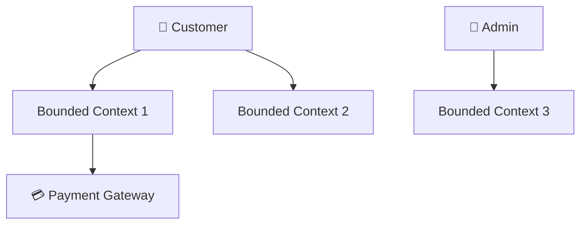
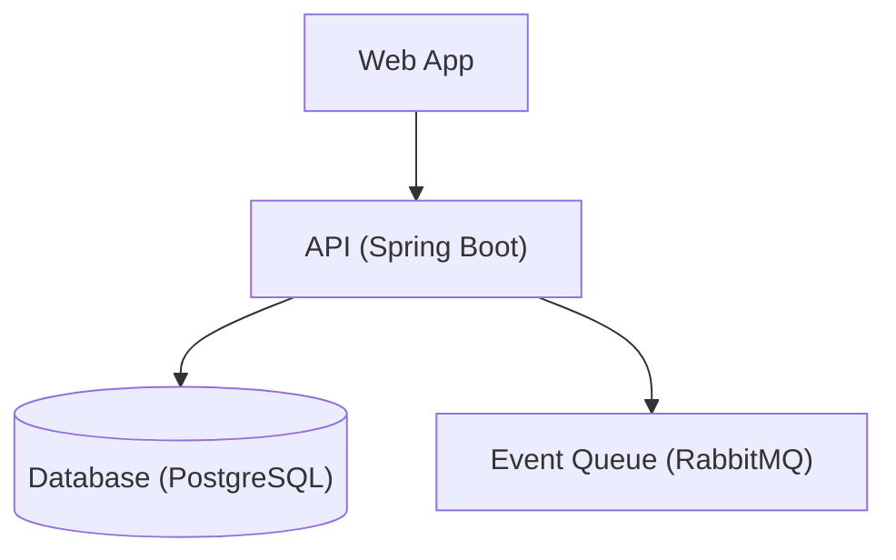

# DDD Architecture Documentation

Generate comprehensive DDD architecture documentation: C4 model diagrams (L1-L4), ADRs, domain model docs, API docs, decision logs, and team communication templates.

## Workflow

Follow this 5-step workflow when generating architecture documentation:

```
Step 1: Understand Context — Project size, team, tech stack, domain
Step 2: Identify Audiences — Business / dev / ops
Step 3: Select C4 Level — L1 for business, L2 for ops, L3 for dev team
Step 4: Check Decisions — Any existing ADRs? Need to create new ones?
Step 5: Generate Output — Combine diagrams + ADRs + templates into one doc
```

**When info is insufficient**: give a best-guess version first based on common patterns (e.g., e-commerce) + list what specific information is still needed. Never just say "请提供更多信息".

## Boundary

### ✅ 擅长处理
1. **C4 模型图生成** — L1 System Context / L2 Container / L3 Component / L4 Code（Mermaid）
2. **ADR 架构决策记录** — 模板 + 索引 + 状态追踪
3. **领域模型文档** — 聚合描述 + 实体/值对象/事件列表
4. **API 文档** — CQRS 命令/查询分离的 API 规范

### ⚠️ 需要条件
1. **已有架构决策** — 需要先有决策才能记录 ADR
2. **已识别限界上下文** — 至少知道系统有哪些 BC 才能画 C4 L1 图
3. **技术栈已知** — 需要知道框架/数据库/中间件才能生成 L2 容器图

### ❌ 超出范围（不适用场景）
1. **无架构决策 → 先做决策再文档**（路由到 `ddd-architecture-selector`）
2. **单人项目 → README + 行内注释即可**
3. **需架构选型 → `ddd-architecture-selector`**
4. **需代码审查 → `ddd-code-reviewer`**

## Audience

This skill is designed for: **Backend developers** (implementing DDD architectures), **Software architects** (evaluating and selecting patterns), **Tech leads** (reviewing team implementations), and **DDD beginners** (learning domain-driven design fundamentals).

## Rules

1. Every architecture decision must be documented as an ADR.
2. C4 diagrams must follow Level 1→4 hierarchy.
3. Domain model documentation must reference bounded contexts.
4. All decision logs must include date, context, options, and rationale.

## C4 模型四层

### DDD → C4 Mapping

```
C4 Level     | DDD Context                   | Audience
─────────────┼───────────────────────────────┼────────────────
L1 Context   | All bounded contexts + externals | Business, Architects
L2 Container | Per-BC deployment units        | Architects, DevOps
L3 Component | BC internal layers (Adapter/App/Domain/Infra) | Dev Team
L4 Code      | Aggregate internals (entities, VOs, events) | Developers
```

### L1: System Context — 展示系统与外部关系



### L2: Container — 单个 BC 的部署单元



L3/L4 完整 Mermaid 代码示例见 `references/01-c4-examples.md`。

**When to use each level**: L1 for project kickoff, L2 for ops handover, L3 for daily dev reference, L4 for complex aggregates only.

## ADR (Architecture Decision Record)

### ADR Template

```markdown
# ADR-{NNN}: {Short Title}

## Status
{Proposed / Accepted / Deprecated / Superseded}

## Context / Decision / Alternatives / Consequences
- **Context**: Why is this decision needed?
- **Decision**: What did we decide?
- **Alternatives**: Options considered with pros/cons, mark chosen
- **Consequences**: Positive + negative impacts
- **Related**: ADR-{NNN}: {related}
```

### ADR Status Tracking Table

```markdown
| ADR# | Title | Status | Date | Superseded By |
|------|-------|:------:|:----:|:----:|
| 001 | Choose COLA Architecture | Accepted | 2024-03-15 | — |
| 002 | CQRS Strategy L2 | Accepted | 2024-03-20 | — |
| 003 | MySQL over PostgreSQL | Deprecated | 2024-02-01 | ADR-005 |
```

## Domain Model Documentation

Document each aggregate:

```markdown
## Aggregate: {Name}
- **Root**: {ClassName} | **Id**: {IdType}
- **Entities**: Table of entity / owner / lifecycle
- **Value Objects**: Table of VO / fields / immutable
- **Domain Events**: Table of event / trigger / consumer
- **Invariants**: 1. {Invariant 1}
- **State Machine**: ```mermaid stateDiagram-v2```
```

## API Documentation — CQRS 命令/查询分离

| API Type | Method | Example | CQRS Model |
|----------|--------|---------|:----------:|
| Command | POST/PUT/DELETE | `POST /orders` | Command Model |
| Query | GET | `GET /orders?status=PAID` | Query Model |

**Command API**: triggers domain behavior, publishes domain events, idempotent key required.
**Query API**: reads from query model (may be separate read DB), no side effects.

## Architecture Decision Log

Maintain a central index:

```
docs/adrs/
├── README.md          ← Auto-generated ADL index
├── ADR-001-title.md
└── ...
```

**Best practices**: one ADR file = one decision; ADR in the same repo as code; CI auto-generates the index.

## 文档维护策略

| 策略 | 频率 | 谁负责 |
|------|:----:|--------|
| PR 时同步更新 ADR + 图 | 每次代码变更 | 开发者 |
| C4 图季度审计 | 每季度 | 架构师 |
| ADL 索引自动生成 | 每次 ADR 变更 | CI |
| 全量架构文档 Review | 每月 | 架构组 |

**Golden rule**: if code changes the architecture, the doc changes in the same PR.

## Gotchas — Common Pitfalls

1. **C4 层级乱用** — 每层有明确定义，不要混用。
2. **ADR 写太晚** — 决策时同步记录，哪怕只写一句话。
3. **文档与代码不同步** — 每次架构变更后必须更新。
4. **只画图不写决策理由** — C4 展示 What，ADR 解释 Why。
5. **图过于复杂** — 每张图 5-7 节点为限。
6. **过度文档** — 聚焦"别人需要知道什么才能开发"。
7. **ADR 不写备选** — 必须记录为什么没选其他方案。
8. **忽略受众** — 不同受众用不同 C4 级别。

## FAQ

**Q1: 文档应该用什么工具？** 先用 Mermaid，复杂度上升后考虑 Structurizr。

**Q2: 需要画哪些 C4 层级？** L1 + L2 是必须的，L3 视团队规模（>5 人推荐）。

**Q3: 怎么保证文档不过期？** PR 勾选框 + CI 检查 ADR 一致性 + 月度 Review。

**Q4: 遗留系统没有文档怎么办？** 先画 AS-IS 的 L1 图 → 记录关键 ADR → 每 sprint 完善一个 BC。

**Q5: ADR 需要写多详细？** 至少包含背景、决策、备选方案（≥2 个）和影响。

**Q6: 多人同时改一个 BC 的文档怎么处理？** Git 冲突解决机制即可，PR Review 时同步 Review 文档。

## Security & Safety

This skill is pure documentation. It does not collect user data, does not access external services or networks, and contains no executable scripts.

## Keywords

- Keywords: architecture documentation, 架构文档, ADR, C4 diagram, C4 模型, architecture decision record, 架构决策记录, domain model doc, 领域模型文档, 技术文档, 架构图, system context, container diagram, component diagram, code diagram, 架构评审, 文档模板, architecture decision log

## References

| File | Content | When to Reference |
|------|---------|-------------------|
| `references/01-c4-examples.md` | Full C4 L1-L4 Mermaid examples for e-commerce | User needs complete C4 diagrams to copy-paste |
| `references/02-adr-templates.md` | 3 ADR template variants (standard, lightweight, tech) | User needs to write a new ADR |
| `references/03-doc-templates.md` | 3 architecture doc templates (full, lightweight, onboarding) | User needs a document structure to start with |
| `references/04-toolchain.md` | Tool recommendations (Structurizr, Mermaid, PlantUML, ArchUnit) | User asks about tools or automation |
| `references/05-team-templates.md` | Team communication templates (review request, change notice) | User needs to notify or review with team |
| `references/06-arch-decision-log.md` | ADL index format + CI automation | User needs to maintain or automate ADR tracking |
| `references/07-domain-model-doc.md` | Aggregate/BC documentation patterns | User needs to document domain models |
| `references/08-api-doc-patterns.md` | CQRS API documentation patterns + OpenAPI spec | User needs to document APIs with CQRS |
| `references/09-trace-anti-patterns.md` | Architecture doc anti-patterns (5 categories) | User needs to avoid common documentation mistakes |
| `references/10-faq-deep.md` | In-depth FAQ (microservices ADR, legacy systems, security) | User has advanced or edge-case questions |

## Related Skills

- [ddd-architecture-selector](../ddd-architecture-selector/) — Architecture selection (before you document, make decisions)
- [ddd-architecture-evaluator](../ddd-architecture-evaluator/) — Periodic architecture health check
- [ddd-code-reviewer](../ddd-code-reviewer/) — Code-level DDD compliance check
- [ddd-cqrs-architecture](../ddd-cqrs-architecture/) — CQRS detail for API documentation
- [awesome](../ddd-architecture-awesome/) — DDD concept overview
