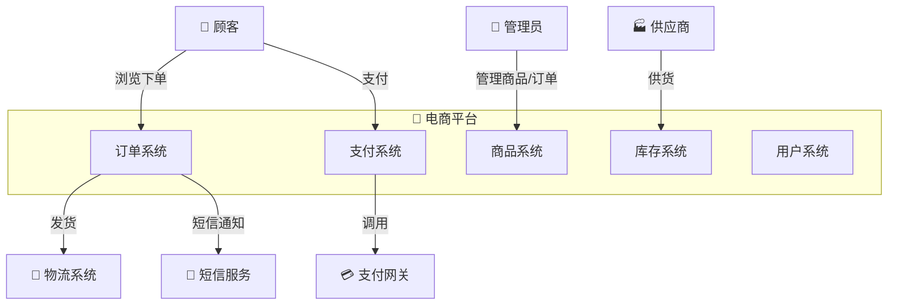
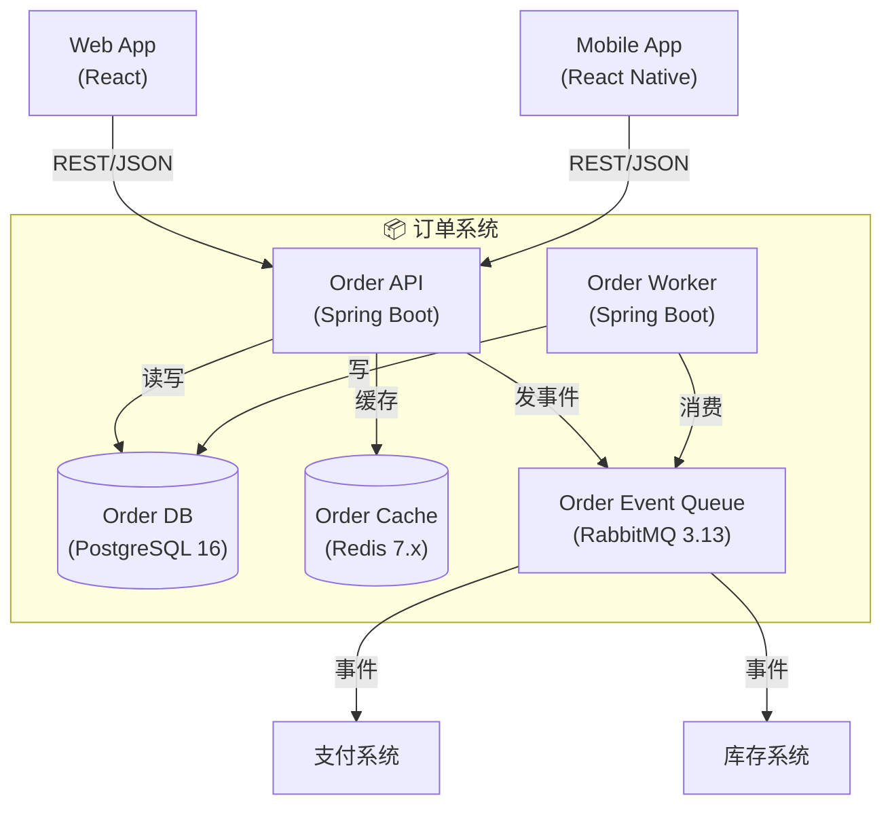
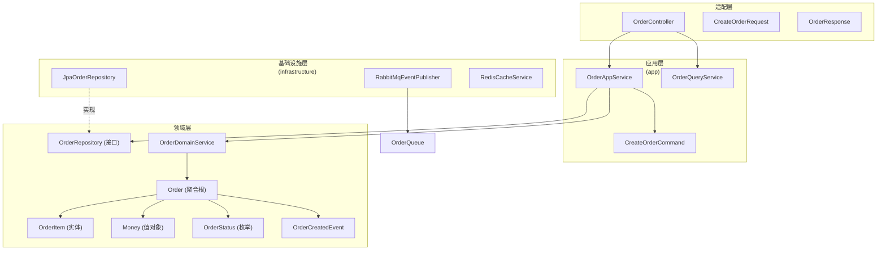
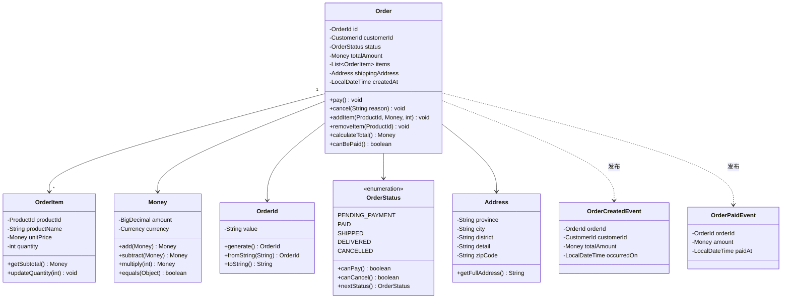

# C4 图完整示例 — 电商平台

> 本文档展示电商平台完整的 C4 四层图示例。
> 所有图表使用 Mermaid 格式，可直接嵌入架构文档。

---

## L1: System Context — 电商平台全景

**说明**：L1 图展示电商平台与外部角色的交互。这是给业务方和架构师看的"电梯演讲"图。

---

## L2: Container — 订单系统内部容器

**说明**：L2 图展示订单系统内部的容器划分和技术选型。开发者和 DevOps 关注的层面。

---

## L3: Component — 订单 API 的 COLA 四层

**说明**：L3 图展示 COLA 四层架构中每个层的核心组件及其依赖关系。这是开发者日常工作的主要参考图。

---

## L4: Code — 订单聚合类图

**说明**：L4 图展示 Order 聚合的内部类结构。开发者实现具体功能时的参考。

---

## 关键映射：DDD ↔ C4

| DDD 概念 | C4 级别 | 谁看 |
|---------|---------|------|
| 全系统所有限界上下文 | L1 System Context | 业务方、架构师 |
| 每个限界上下文部署单元 | L2 Container | 架构师、DevOps |
| 每个容器的 Adapter/App/Domain/Infra | L3 Component | 开发团队 |
| 聚合内部结构（实体、值对象、事件） | L4 Code | 开发者 |
