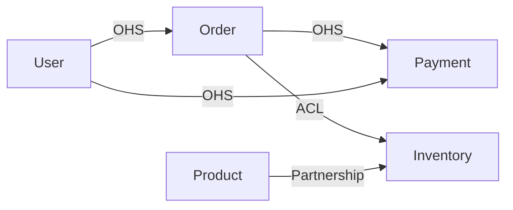
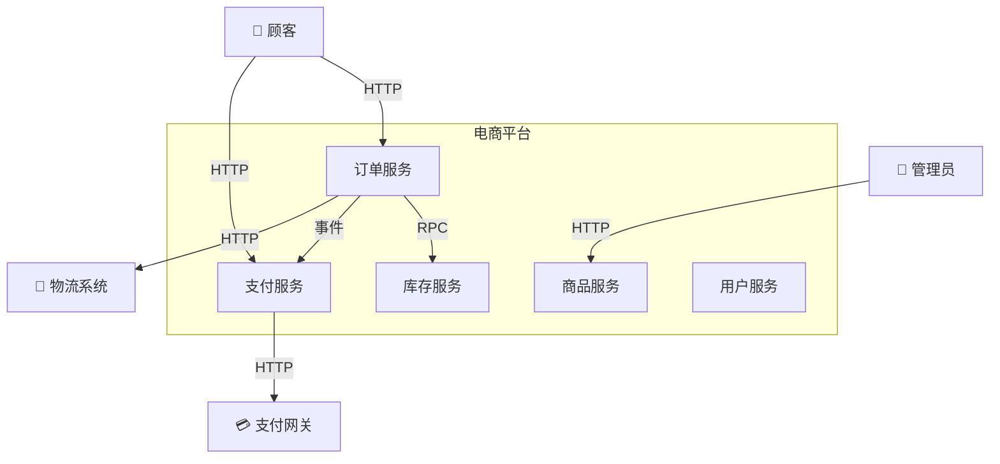
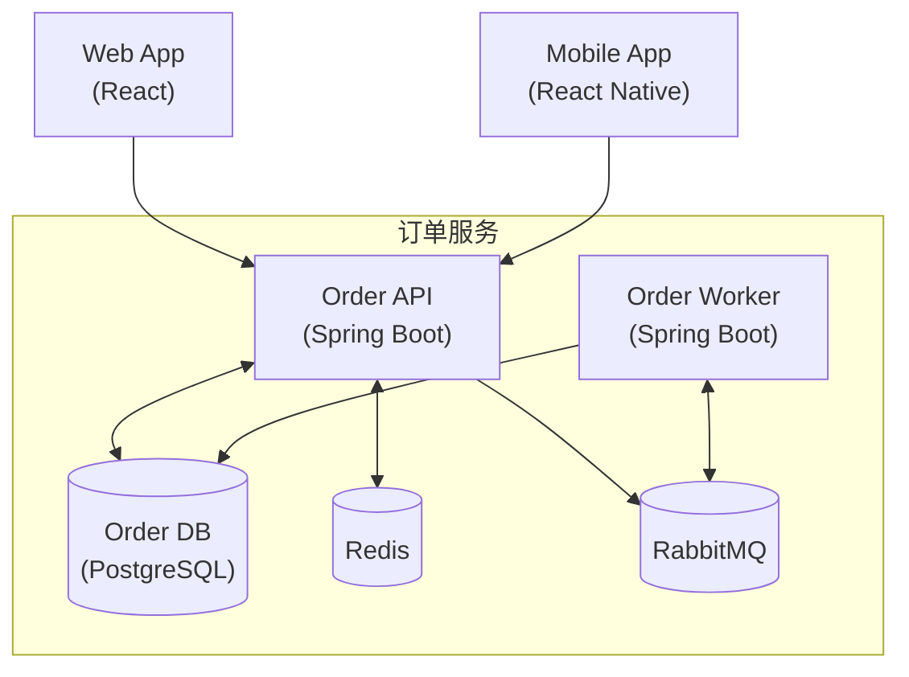

# 完整架构文档示例 — 电商平台

> 本文档展示一个完整的电商平台架构文档。

---

# 电商平台架构文档

> 版本: v2.1 | 最后更新: 2024-06-01 | 负责人: 架构组

---

## 1. 架构概览

### 1.1 架构模式
- **架构**: COLA v5（菱形架构）
- **CQRS 级别**: L2（数据库分离 — 写库 PostgreSQL / 读库 Elasticsearch）
- **微服务**: 5 个服务（订单、支付、商品、库存、用户）

### 1.2 架构约束
1. **依赖规则**: 领域层不依赖任何外部框架
2. **聚合规则**: 聚合之间通过 ID 引用，不直接引用对象
3. **事务规则**: 一个事务只修改一个聚合
4. **事件规则**: 跨聚合操作通过领域事件实现最终一致性

---

## 2. 限界上下文

| 上下文 | 类型 | 职责 | 微服务 | 语言 |
|--------|------|------|:------:|:----:|
| Order | 核心域 | 订单创建/支付/退款 | ✓ | Java |
| Payment | 核心域 | 支付渠道对接/对账 | ✓ | Java |
| Product | 支撑域 | 商品信息/分类/搜索 | ✓ | Java |
| Inventory | 支撑域 | 库存管理/锁定/释放 | ✓ | Java |
| User | 通用域 | 用户注册/认证/权限 | ✓ | Java |

### 上下文映射

**图例**: OHS=开放主机服务, ACL=防腐层, Partnership=伙伴关系

---

## 3. C4 模型

### L1: System Context

### L2: Container — 订单服务

---

## 4. 技术栈

| 组件 | 技术 | 版本 | 说明 |
|------|------|:----:|------|
| 开发语言 | Java | 21 | — |
| 框架 | Spring Boot | 3.4.x | — |
| ORM | MyBatis Plus | 3.5.x | — |
| 数据库 | PostgreSQL | 16 | 写库 |
| 搜索引擎 | Elasticsearch | 8.x | 读库 |
| 缓存 | Redis | 7.x | 会话 + 缓存 |
| 消息队列 | RabbitMQ | 3.13 | 事件驱动 |
| 注册中心 | Nacos | 2.x | 服务发现 |
| 网关 | Spring Cloud Gateway | 4.x | — |
| 部署 | Kubernetes | 1.28 | — |

---

## 5. ADR 索引

| ADR# | 标题 | 状态 | 日期 | 负责人 |
|------|------|:----:|:----:|:------:|
| 001 | 选择 COLA v5 作为基础架构 | 已采纳 | 2024-03-15 | 张三 |
| 002 | CQRS L2 策略（DB 分离） | 已采纳 | 2024-03-20 | 李四 |
| 003 | 事件中间件: RabbitMQ | 已采纳 | 2024-03-25 | 王五 |
| 004 | MySQL → PostgreSQL 迁移 | 已采纳 | 2024-04-01 | 张三 |
| 005 | 单体 → 微服务拆分方案 | 已采纳 | 2024-05-01 | 赵六 |

---

## 6. 架构评审 Checklist

- [x] 依赖方向正确（Domain 零框架依赖）
- [x] 聚合间 ID 引用（无直接对象引用）
- [x] 关键操作有领域事件（OrderCreated, OrderPaid）
- [x] 跨聚合操作使用事件（下单 → 锁定库存）
- [x] ADR 记录完整（5 个决策）
- [x] C4 图与代码一致（已验证）
- [x] ArchUnit 集成 CI（通过）
