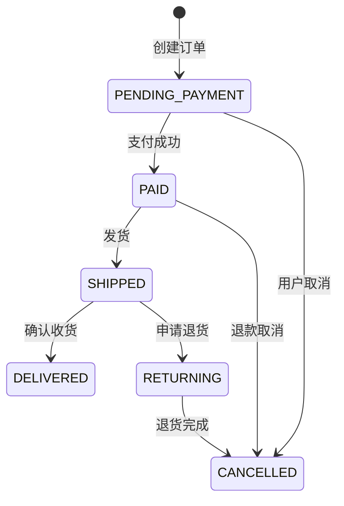
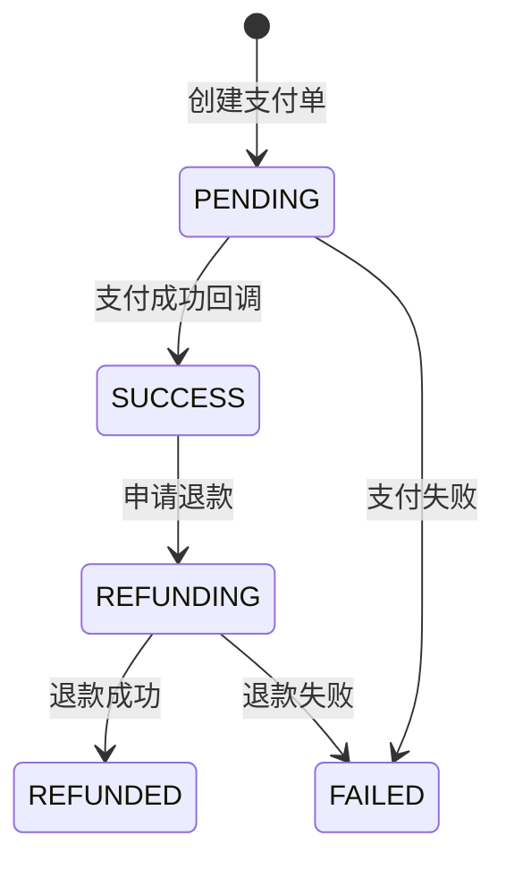
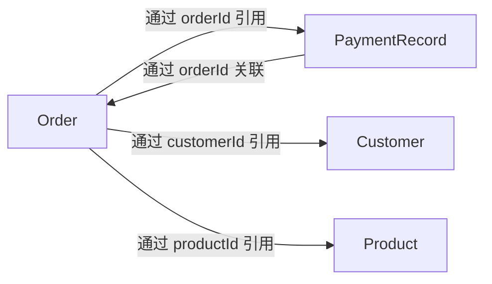

# 领域模型文档示例

> 本文档展示电商平台 Order 和 Payment 两个主要聚合的领域模型文档。

---

## 聚合：订单（Order）

### 概述
订单是电商平台的核心聚合，管理订单从创建到完成的整个生命周期。

### 聚合根
- **类名**: `Order`
- **标识**: `OrderId`（值对象，UUID 格式）
- **业务标识**: `orderNumber`（人工可读，如 "ORD-20240501-00001"）

### 业务规则（不变式 Invariants）
1. **不可重复支付**: 订单只能支付一次，PAID 后不能再次支付
2. **金额一致性**: 订单总金额 = 所有 OrderItem 金额之和
3. **合法状态转换**: 状态机必须经过 PENDING_PAYMENT → PAID → SHIPPED → DELIVERED
4. **取消条件**: 只有 PENDING_PAYMENT 和 PAID 状态的订单可以取消（PAID 取消需退款）
5. **商品数量限制**: 单笔订单最多 50 个商品

### 状态机

### 实体（Entity）

| 实体 | 聚合内唯一 | 生命周期 | 说明 |
|------|:---------:|---------|------|
| Order | ✓（聚合根） | 从创建到完成 | 订单主体 |
| OrderItem | ✓ | 随 Order | 订单中的商品行 |

### 值对象（Value Object）

| 值对象 | 包含字段 | 不可变 | 说明 |
|--------|---------|:------:|------|
| OrderId | value: UUID | ✓ | 订单唯一标识 |
| Money | amount, currency | ✓ | 金额（BigDecimal + Currency） |
| OrderStatus | status: Enum | ✓ | 订单状态 |
| Address | province, city, district, detail | ✓ | 收货地址 |

### 领域事件

| 事件 | 触发条件 | 包含数据 | 消费者 |
|------|---------|---------|--------|
| OrderCreatedEvent | 订单创建成功 | orderId, customerId, totalAmount | 库存服务（锁定库存） |
| OrderPaidEvent | 支付成功 | orderId, amount, paidAt | 物流服务（准备发货） |
| OrderCancelledEvent | 订单取消 | orderId, reason | 库存服务（释放库存） |
| OrderShippedEvent | 已发货 | orderId, trackingNumber | 用户通知服务 |

### 领域服务

| 服务 | 职责 | 为什么不是实体方法 |
|------|------|------------------|
| OrderPricingService | 计算订单价格（考虑优惠券、积分、会员折扣） | 涉及多个外部策略，不是订单自身的逻辑 |
| OrderValidationService | 验证下单（用户限购、商品限购、风控） | 跨多个聚合（User、Product）的校验 |

---

## 聚合：支付记录（PaymentRecord）

### 概述
支付记录聚合管理每笔支付的生命周期，包括支付、退款、对账。

### 聚合根
- **类名**: `PaymentRecord`
- **标识**: `PaymentId`（值对象）
- **业务标识**: `paymentNo`（支付单号）

### 业务规则
1. **支付金额一致性**: 支付金额必须等于对应订单的待支付金额
2. **不可重复支付**: 一个订单只能有一笔成功的支付记录
3. **退款金额上限**: 退款金额 ≤ 已支付金额
4. **渠道幂等**: 同一个支付渠道流水号只能处理一次

### 状态机

### 值对象

| 值对象 | 说明 |
|--------|------|
| PaymentId | 支付唯一标识 |
| Money | 金额（与 Order 共享） |
| PaymentChannel | 支付渠道枚举（WeChat/AliPay/UnionPay） |
| PaymentStatus | 支付状态枚举 |

### 领域事件

| 事件 | 触发条件 | 消费者 |
|------|---------|--------|
| PaymentSucceededEvent | 支付成功 | Order（更新订单为已支付） |
| PaymentRefundedEvent | 退款成功 | Order（更新订单为已取消） |

---

## 聚合间关系

**关键设计决策**:
- 所有跨聚合引用使用 ID（值对象），不使用对象引用
- Order 和 PaymentRecord 通过异步事件（OrderPaidEvent / PaymentSucceededEvent）协作
- Order 不直接持有 PaymentRecord 的引用，而是通过领域事件驱动协作
