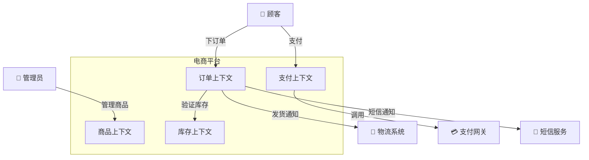
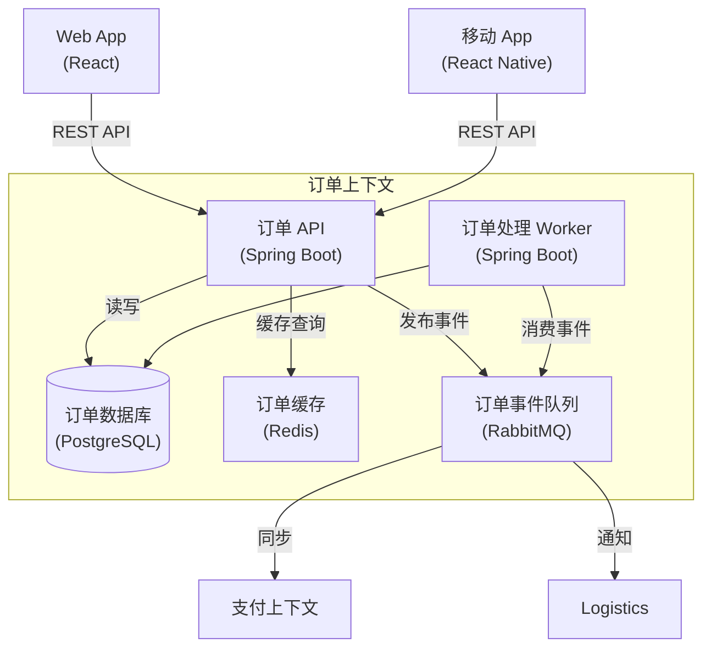
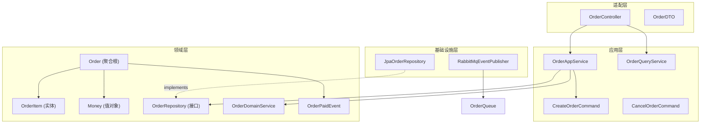
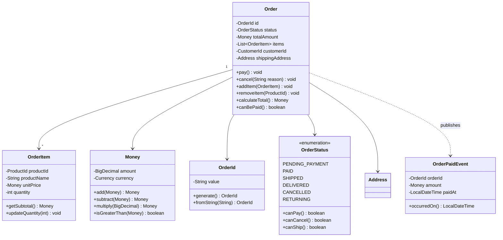

# C4 模型示例 — 电商平台完整四层图

> 本文档提供电商平台的 C4 模型全四层 Mermaid 图例，可直接嵌入架构文档。

---

## L1: System Context Diagram

## L2: Container Diagram — 订单上下文

## L3: Component Diagram — 订单上下文的 COLA 四层

## L4: Code Diagram — 订单聚合内部结构

