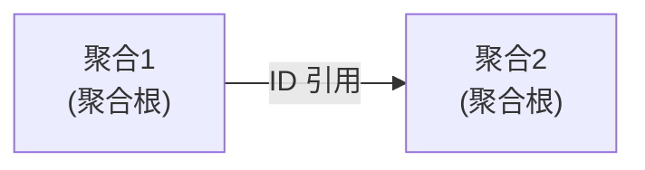

# 领域模型文档化模式

> 本文档提供领域模型文档化的最佳实践和模板。

---

## 1. 聚合文档模板

```markdown
## 聚合：{聚合名称}

### 概述
{一句话描述这个聚合负责什么业务}

### 聚合根
- **类名**: {ClassName}
- **标识**: {IdType}
- **业务标识**: {业务主键，如订单号}

### 实体
| 实体 | 父聚合根 | 生命周期 |
|------|---------|---------|
| {Entity1} | {AggregateRoot} | 随聚合根 |

### 值对象
| 值对象 | 包含字段 | 不可变 |
|--------|---------|:------:|
| {ValueObject1} | {field1}, {field2} | ✅ |

### 领域事件
| 事件 | 触发条件 | 消费者 |
|------|---------|--------|
| {Event1} | {条件} | {谁处理} |

### 业务不变式（Invariants）
1. {不变式 1}
2. {不变式 2}
```

## 2. 限界上下文文档模板

```markdown
## 限界上下文：{上下文名称}

### 基本信息
- **类型**: {核心域 / 支撑域 / 通用域}
- **负责人**: {团队名称}
- **代码仓库**: {repository URL}

### 领域模型概览
> 嵌入聚合关系图（Mermaid）



### 聚合清单
| 聚合 | 聚合根 | 说明 |
|------|--------|------|
| {Aggregate1} | {Class1} | {说明} |

### 上下文映射
| 上游上下文 | 下游 | 关系类型 |
|-----------|------|---------|
| {上游BC} | {下游BC} | ACL/OHS/Partnership |

### 领域服务
| 服务名 | 职责 | 位置 |
|--------|------|:----:|
| {Service1} | {职责} | Domain 层 |

### 仓储接口
| 仓库 | 对应聚合 | 主要查询 |
|------|---------|---------|
| {Repository1} | {Aggregate1} | findByXXX, save |
```

## 3. 文档化最佳实践

| 实践 | 反例 | 正例 |
|------|------|------|
| 用业务语言 | "Order 有 status 字段" | "订单状态决定了用户可以执行的操作" |
| 说明业务规则 | "pay() 方法更新状态" | "只有 DRAFT 状态的订单才能支付，支付后状态变为 PAID" |
| 明确聚合边界 | "Order 引用 Customer 对象" | "Order 通过 customerId 引用 Customer 聚合" |
| 记录领域事件 | 不写事件触发条件 | "当订单支付成功时发布 OrderPaidEvent" |
| 解释值对象 | "Money 是 BigDecimal" | "Money 封装金额计算（加、减、乘、比较），保证金额精确计算" |

## 4. 领域模型变更记录

```markdown
# {聚合名称} 领域模型变更日志

| 日期 | 版本 | 变更内容 | 原因 | ADR |
|:----:|:----:|---------|------|:---:|
| 2024-03-15 | v2.0 | Order 增加 shippingAddress 字段 | 支持多地址发货 | ADR-012 |
| 2024-02-01 | v1.5 | OrderItem 从实体改为值对象 | 订单项不可修改 | ADR-008 |
```
