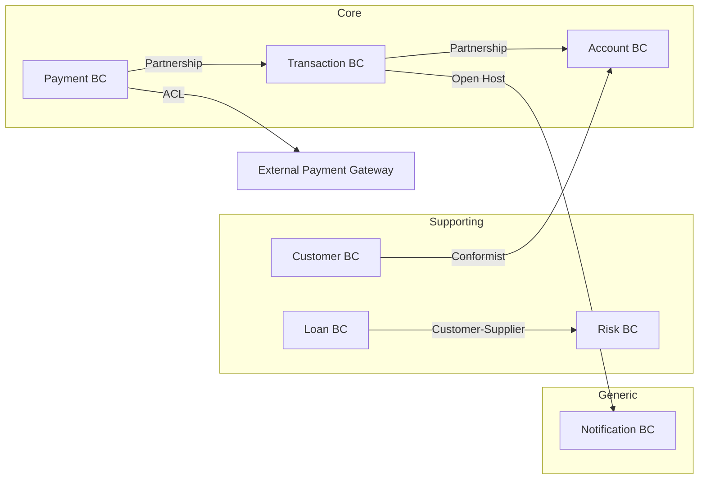

# 银行领域设计示例

银行系统完整的 DDD 领域设计案例。

## 1. 产品愿景

> FOR 个人用户和企业客户 WHO 需要安全、便捷的银行服务，
> OUR 数字银行系统 IS 一个全渠道金融服务平台
> THAT 提供账户管理、转账支付、贷款申请和理财服务。
> UNLIKE 传统银行网点，OUR product 提供 7×24 在线服务和实时交易处理。

## 2. 限界上下文划分

| 上下文 | 类型 | 职责 | 核心聚合 |
|--------|------|------|---------|
| **Account** | Core | 账户生命周期管理 | Account |
| **Transaction** | Core | 交易处理与记账 | Transaction, LedgerEntry |
| **Payment** | Core | 支付指令处理 | PaymentOrder |
| **Customer** | Supporting | 客户信息管理 | Customer |
| **Loan** | Supporting | 贷款申请与审批 | LoanApplication, LoanAgreement |
| **Risk** | Supporting | 风控规则引擎 | RiskAssessment |
| **Notification** | Generic | 消息通知发送 | Notification |

## 3. 上下文映射



## 4. 聚合设计

### Account 聚合

| 元素 | 类型 | 说明 |
|------|------|------|
| **Account** | Aggregate Root | 账户聚合根，管理账户状态 |
| **AccountId** | Value Object | UUID 类型标识 |
| **Money** | Value Object | 金额（不可变） |
| **AccountType** | Value Object | 枚举：SAVING/CHECKING/CREDIT |
| **AccountStatus** | Value Object | ACTIVE/FROZEN/CLOSED |
| **OverdraftLimit** | Value Object | 透支额度 |
| **InterestRate** | Value Object | 利率 |

**不变式**:
1. 账户余额不能低于 -OverdraftLimit
2. FROZEN 账户禁止任何交易
3. CLOSED 账户不可恢复为 ACTIVE

**领域事件**: AccountCreated, AccountFrozen, AccountClosed, OverdraftLimitChanged

### Transaction 聚合

| 元素 | 类型 | 说明 |
|------|------|------|
| **Transaction** | Aggregate Root | 交易记录聚合根 |
| **TransactionId** | Value Object | 全局唯一交易流水号 |
| **TransactionType** | Value Object | DEPOSIT/WITHDRAW/TRANSFER |
| **Money** | Value Object | 交易金额 |
| **LedgerEntry** | Entity | 分类账分录 |

**不变式**:
1. 借方总额 = 贷方总额（会计恒等式）
2. 转账交易的 source 与 target 账户不能相同
3. 交易金额必须 > 0

## 5. 领域事件时间线

```
客户转账
  │
  ├── TransferInitiated          → 风控检查
  ├── RiskCheckPassed            → 扣减源账户
  ├── SourceAccountDebited       → 增加目标账户
  ├── TargetAccountCredited      → 发送通知
  └── TransferCompleted          → 记录交易明细
```

## 6. 代码映射

| 领域对象 | 代码对象 | 包路径 |
|---------|---------|--------|
| Account | Account DO | domain/account/entity/Account.java |
| AccountId | AccountId VO | domain/account/valueobject/AccountId.java |
| Transaction | Transaction DO | domain/transaction/entity/Transaction.java |
| Money | Money VO | domain/shared/valueobject/Money.java |
| TransferInitiated | TransferInitiatedEvent | domain/transaction/event/TransferInitiatedEvent.java |
| AccountRepository | AccountRepository | domain/account/repository/AccountRepository.java |
