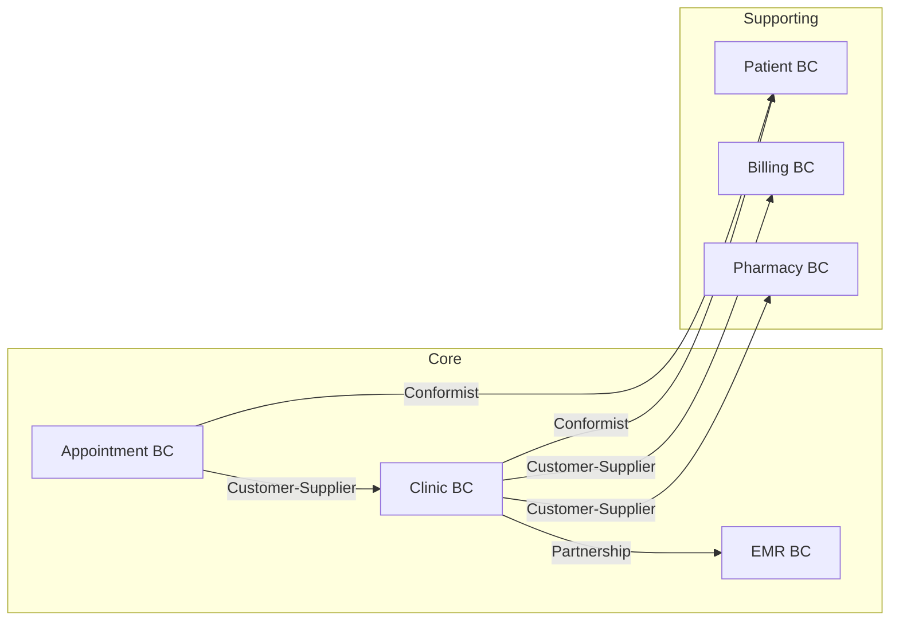

# 医疗健康领域设计示例

医疗健康系统的 DDD 领域设计案例。

## 1. 产品愿景

> FOR 医疗机构和患者 WHO 需要高效、安全的医疗服务管理，
> OUR 医疗健康平台 IS 一个全流程智慧医疗系统
> THAT 提供预约挂号、电子病历、诊疗管理和药房管理。
> UNLIKE 传统纸质病历管理，OUR product 提供电子化诊疗记录和跨院数据共享。

## 2. 限界上下文划分

| 上下文 | 类型 | 职责 | 核心聚合 |
|--------|------|------|---------|
| **Appointment** | Core | 预约挂号管理 | Appointment, Schedule |
| **Clinic** | Core | 诊疗过程管理 | Consultation, Diagnosis |
| **EMR** | Core | 电子病历管理 | MedicalRecord, ClinicalNote |
| **Pharmacy** | Supporting | 药房处方管理 | Prescription, Dispensation |
| **Billing** | Supporting | 医疗费用结算 | Invoice, Payment |
| **Patient** | Supporting | 患者信息管理 | Patient |

## 3. 上下文映射

## 4. 聚合设计

### Appointment 聚合

| 元素 | 类型 | 说明 |
|------|------|------|
| **Appointment** | Aggregate Root | 预约挂号聚合根 |
| **AppointmentId** | Value Object | 预约编号 |
| **AppointmentStatus** | Value Object | BOOKED → CHECKED_IN → COMPLETED → CANCELLED |
| **TimeSlot** | Value Object | 时间段（date, startTime, endTime） |
| **PatientInfo** | Value Object | 患者摘要（name, patientId） |
| **DoctorInfo** | Value Object | 医生摘要 |

**不变式**:
1. 同一医生在同一时段只能有一个预约
2. 一个患者一天内同科室最多预约 1 次
3. 取消预约必须在预约时间 2 小时前

### Consultation 聚合

| 元素 | 类型 | 说明 |
|------|------|------|
| **Consultation** | Aggregate Root | 诊疗记录聚合根 |
| **ConsultationId** | Value Object | 诊疗编号 |
| **Diagnosis** | Entity | 诊断记录（ICD 编码） |
| **VitalSigns** | Value Object | 生命体征（temperature, bloodPressure, heartRate） |
| **PrescriptionRef** | Value Object | 处方引用 |

**不变式**:
1. 诊疗必须有诊断结论
2. 处方药品总量不超过该药品单次最大剂量
3. 诊疗记录一旦完成不可修改（可追加）

## 5. 领域事件目录

| 事件 | 触发条件 | 消费者 |
|------|---------|--------|
| AppointmentBooked | 患者预约成功 | Clinic, Notification |
| AppointmentCheckedIn | 患者到诊 | Consultation |
| DiagnosisCompleted | 诊疗完成 | EMR, Pharmacy, Billing |
| PrescriptionIssued | 处方开具 | Pharmacy |
| MedicationDispensed | 药品发放完毕 | Billing, Notification |

## 6. 代码映射

| 领域对象 | 代码对象 | 包路径 |
|---------|---------|--------|
| Appointment | Appointment DO | domain/appointment/entity/Appointment.java |
| TimeSlot | TimeSlot VO | domain/appointment/valueobject/TimeSlot.java |
| Consultation | Consultation DO | domain/clinic/entity/Consultation.java |
| VitalSigns | VitalSigns VO | domain/clinic/valueobject/VitalSigns.java |
| DiagnosisCompleted | DiagnosisCompletedEvent | domain/clinic/event/DiagnosisCompletedEvent.java |
| AppointmentRepository | AppointmentRepository | domain/appointment/repository/AppointmentRepository.java |
