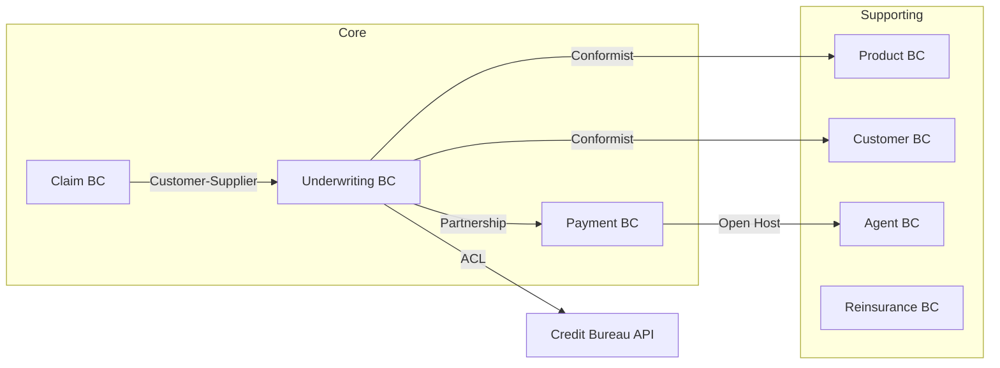

# 保险领域设计示例

保险业务完整的 DDD 领域设计案例。

## 1. 产品愿景

> FOR 有保障需求的个人和企业客户 WHO 希望获得合适的保险产品，
> OUR 保险核心系统 IS 一个全流程保险业务平台
> THAT 覆盖投保、承保、理赔、续保全生命周期。
> UNLIKE 传统纸质投保流程，OUR product 提供在线投保和即时承保能力。

## 2. 限界上下文划分

| 上下文 | 类型 | 职责 | 核心聚合 |
|--------|------|------|---------|
| **Underwriting** | Core | 投保、核保、出单 | Proposal, Policy |
| **Claim** | Core | 理赔处理 | Claim, Assessment |
| **Payment** | Core | 保费收付 | PremiumPayment |
| **Product** | Supporting | 产品定义与费率 | Product, CoverageDefinition |
| **Customer** | Supporting | 客户信息管理 | Customer |
| **Agent** | Supporting | 代理人管理 | Agent, Commission |
| **Reinsurance** | Supporting | 再保分摊 | ReinsuranceContract |

## 3. 上下文映射

## 4. 聚合设计

### Underwriting 上下文

**Proposal 聚合**:

| 元素 | 类型 | 说明 |
|------|------|------|
| **Proposal** | Aggregate Root | 投保单聚合根 |
| **ProposalId** | Value Object | 投保单号 |
| **ProposalStatus** | Value Object | DRAFT → SUBMITTED → UNDERWRITING → APPROVED/REJECTED |
| **InsuredPerson** | Entity | 被保人信息 |
| **CoverageItem** | Entity | 险种项目 |
| **Premium** | Value Object | 保费计算 |
| **RiskFactor** | Value Object | 风险因子集合 |

**不变式**:
1. 总保费 = 各险种保费之和
2. 投保人年龄不能超过产品承保年龄上限
3. 被保人告知必须完整（不能缺失必填告知项）
4. DRAFT 状态的投保单可以修改，SUBMITTED 后不可修改

**Policy 聚合**:

| 元素 | 类型 | 说明 |
|------|------|------|
| **Policy** | Aggregate Root | 保单聚合根 |
| **PolicyId** | Value Object | 保单号 |
| **PolicyStatus** | Value Object | ACTIVE/LAPSED/SURRENDERED/EXPIRED |
| **CoveragePeriod** | Value Object | 保障期间（startDate, endDate） |
| **Endorsement** | Entity | 批单记录 |

**不变式**:
1. 保单生效日期必须在投保完成日期之后
2. 保障期间内不能重复投保相同的险种
3. 保单状态不允许跳转（如 ACTIVE → SURRENDERED 必须经过校验）

## 5. 领域事件目录 (Underwriting BC)

| 事件 | 触发条件 | 消费者 |
|------|---------|--------|
| ProposalSubmitted | 客户提交投保单 | 核保系统 |
| UnderwritingCompleted | 核保审核完成 | 出单系统 |
| PolicyIssued | 保单生成 | 支付系统、客户通知 |
| PremiumPaid | 首期保费缴纳 | 保单激活 |
| PolicyActivated | 保单生效 | 理赔系统 |
| PolicySurrendered | 退保 | 财务系统 |

## 6. 代码映射

| 领域对象 | 代码对象 | 包路径 |
|---------|---------|--------|
| 投保单 | Proposal DO | domain/underwriting/entity/Proposal.java |
| 保单 | Policy DO | domain/underwriting/entity/Policy.java |
| 保费 | Premium VO | domain/underwriting/valueobject/Premium.java |
| 保障期间 | CoveragePeriod VO | domain/underwriting/valueobject/CoveragePeriod.java |
| 保单已签发 | PolicyIssuedEvent | domain/underwriting/event/PolicyIssuedEvent.java |
| 投保单仓储 | ProposalRepository | domain/underwriting/repository/ProposalRepository.java |
