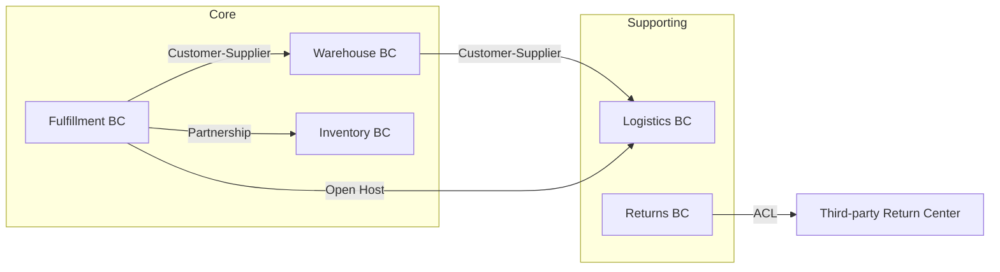

# 订单履约领域设计示例

电商订单履约流程的 DDD 领域设计案例。

## 1. 产品愿景

> FOR 电商平台运营团队 WHO 需要高效处理订单履约流程，
> OUR 订单履约系统 IS 一个自动化的订单处理引擎
> THAT 从订单确认到最终交付的全流程管理。
> UNLIKE 手工分单处理，OUR product 提供智能路由和实时跟踪。

## 2. 限界上下文划分

| 上下文 | 类型 | 职责 | 核心聚合 |
|--------|------|------|---------|
| **Fulfillment** | Core | 履约执行与分单 | FulfillmentOrder, Assignment |
| **Warehouse** | Core | 仓储作业管理 | PickList, Packing |
| **Logistics** | Supporting | 物流配送管理 | Shipment, Tracking |
| **Inventory** | Core | 库存分配 | InventoryReservation |
| **Returns** | Supporting | 退换货处理 | ReturnOrder |

## 3. 上下文映射

## 4. 聚合设计

### FulfillmentOrder 聚合

| 元素 | 类型 | 说明 |
|------|------|------|
| **FulfillmentOrder** | Aggregate Root | 履约单聚合根 |
| **FulfillmentOrderId** | Value Object | 履约单号 |
| **FulfillmentStatus** | Value Object | PENDING → WAREHOUSE → PICKING → PACKING → SHIPPING → DELIVERED |
| **OrderLine** | Entity | 履约行项目 |
| **ShippingAddress** | Value Object | 收货地址 |
| **DeliveryPreference** | Value Object | 配送偏好 |
| **SplitLine** | Value Object | 拆单记录 |

**不变式**:
1. 履约单总行数 = 所有 SplitLine 行数之和
2. 同一履约单只能选择一个仓库发货
3. 配送地址必须在履约区域范围内
4. SHIPPING 状态后不能取消履约

### PickList 聚合

| 元素 | 类型 | 说明 |
|------|------|------|
| **PickList** | Aggregate Root | 拣货单聚合根 |
| **PickListId** | Value Object | 拣货单号 |
| **PickListStatus** | Value Object | CREATED → IN_PROGRESS → COMPLETED |
| **PickItem** | Entity | 拣货项目 |
| **WarehouseZone** | Value Object | 库区信息 |

**不变式**:
1. 拣货单所有 PickItem 数量之和 ≤ 库存可用量
2. 同一 PickList 的 PickItem 必须在同一 WarehouseZone
3. COMPLETED 后 PickList 不可修改

## 5. 领域事件目录

| 领域事件 | 发布者 | 消费者 | 描述 |
|---------|--------|--------|------|
| FulfillmentOrderCreated | Fulfillment | Inventory, Warehouse | 履约单创建，库存分配开始 |
| InventoryReserved | Inventory | Fulfillment, Warehouse | 库存分配完成 |
| PickingCompleted | Warehouse | Fulfillment, Packing | 拣货完成 |
| PackingCompleted | Warehouse | Fulfillment, Logistics | 打包完成 |
| ShipmentDispatched | Logistics | Fulfillment, Notification | 发货出库 |
| DeliveryConfirmed | Logistics | Fulfillment, Returns | 签收确认 |

## 6. 值对象持久化策略

| 值对象 | 策略 | 实现方式 |
|--------|------|---------|
| ShippingAddress | JSON Column | PostgreSQL jsonb |
| Money | Inline Columns | amount + currency 列 |
| DeliveryPreference | JSON Column | 灵活扩展字段 |
| FulfillmentStatus | Enum String | 枚举值持久化为字符串 |
| WarehouseZone | Single Column | 区域代码字符串 |
