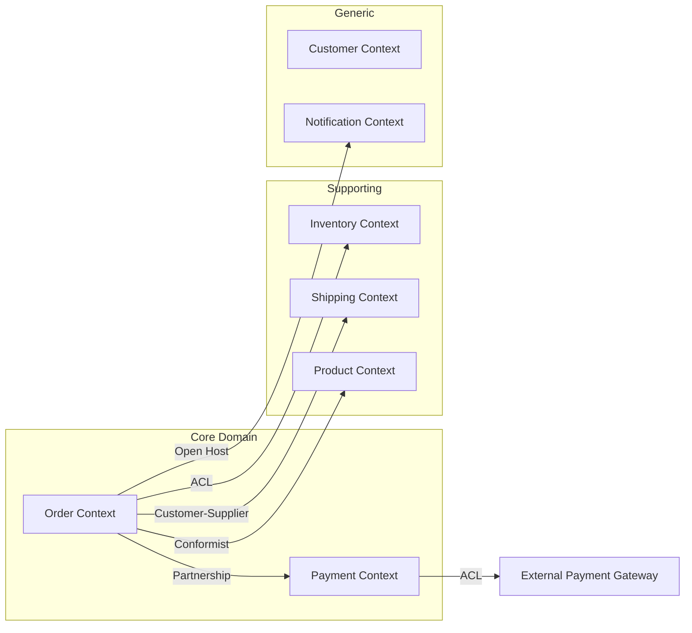

# 限界上下文映射模式详解

> Sources: Eric Evans DDD Blue Book, Vaughn Vernon IDDD

## 7 种上下文映射模式

### Partnership（合作关系）

两个团队/上下文相互依赖，共同演化接口。

```
Team A  ←→  Team B
(Order)      (Payment)
```

**适用**: 两个上下文需要紧密配合的业务流程
**协议**: 共同维护接口测试套件，每次变更双方确认

### Shared Kernel（共享内核）

两个上下文共享领域模型的一个子集。

```
   ┌─────────────────┐
   │  Shared Kernel  │  → Customer, Money, OrderId
   └─────────────────┘
        ↑        ↑
   Order BC  Payment BC
```

**适用**: 高度协作的团队，共享部分模型
**风险**: 共享部分的变更需要双方协调

### Customer-Supplier（客户-供应商）

上游（Supplier）定义接口，下游（Customer）消费，上游需对下游负责。

```
Supplier (Order BC)  ──→  Customer (Shipping BC)
  [定义]                     [消费]
  - OrderStatus              - 根据订单状态安排发货
  - ShippingAddress          - 获取收货地址
```

**适用**: 有明确上下游关系的上下文
**SLA**: 上游需保证向下游承诺的能力

### Conformist（遵奉者）

下游直接采用上游的模型，不建立防腐层。

```
Upstream (Product BC)  ──→  Conformist (Order BC)
  ProductId, Price             直接使用 ProductId
```

**适用**: 上游模型足够好，不值得做转换
**风险**: 上游变更直接影响下游

### Anti-Corruption Layer（防腐层/ACL）

下游建立转换层，保护自己的领域模型不被上游侵染。

```
Upstream (Legacy System)  ──→  ACL  ──→  Order BC
  [Old Customer Model]          [翻译]    [Clean Domain Model]
  - custId:String               custId→ CustomerId
  - addr:String                 addr → Address(VO)
```

**适用**: 集成遗留系统、第三方、外部服务
**价值**: 隔离外部变化、保持领域模型纯净

### Open Host Service（开放主机服务）

上游以协议形式提供服务，供多个下游使用。

```
              ┌──────────────────────┐
              │  Open Host Service   │
              │  ┌────────────────┐  │
              │  │ Payment Gateway│  │
              │  └────────────────┘  │
              └──────────┬───────────┘
                    │
        ┌───────────┼───────────┐
        ▼           ▼           ▼
    Order BC    Shipping BC   Notification
```

### Published Language（发布语言）

使用标准数据格式在上下文间交换数据。

```
Published Language: 标准化事件格式
┌──────────────────────────────┐
│ {                            │
│   "eventType": "OrderPlaced",│
│   "version": "1.0",          │
│   "payload": {...}           │
│ }                            │
└──────────────────────────────┘
```

**适用**: 多团队、多技术栈的系统集成
**常见实现**: JSON Schema, Avro, Protobuf

## 上下文映射决策树

```
需要集成的两个上下文是否同属一个团队？
├── 是 → 考虑 Shared Kernel 或 Partnership
└── 否 → 上游是否稳定？
    ├── 是 → Conformist（简单）或 Open Host Service（多下游）
    └── 否 → Anti-Corruption Layer（推荐）
```

## Mermaid 上下文映射图模板


