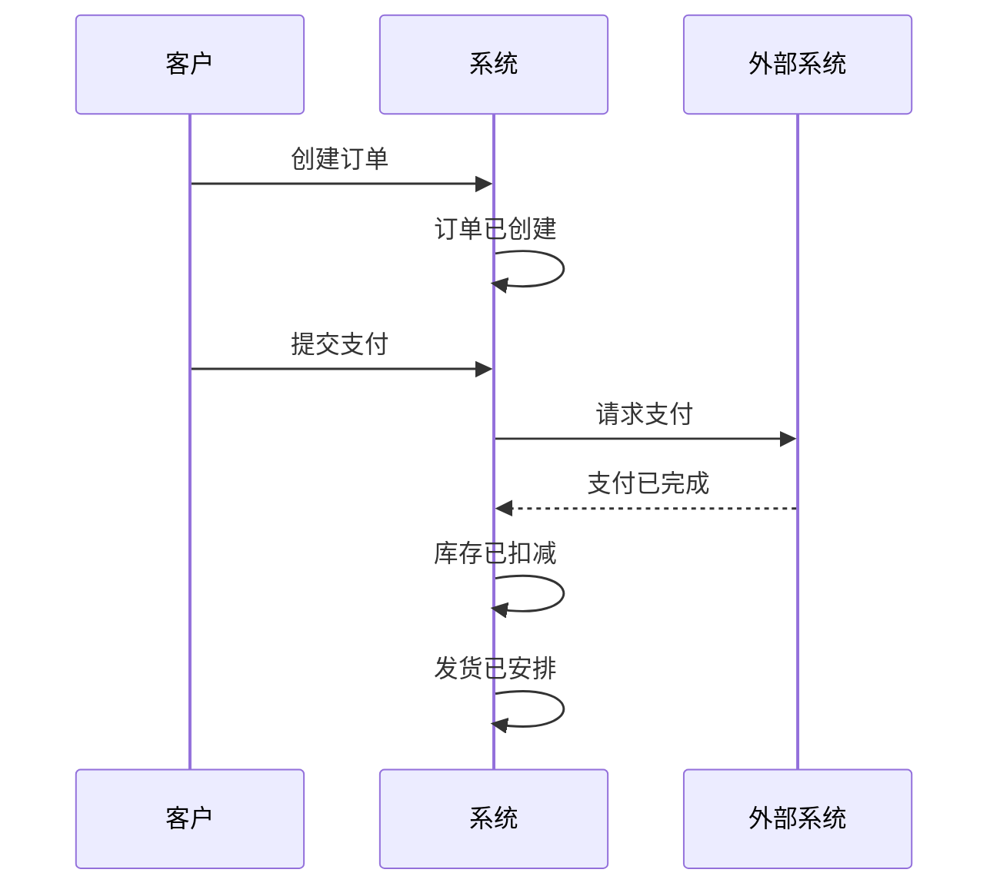

# 事件风暴工作坊产出模板

## 使用方式

工作坊结束后，使用此模板整理产出物，作为 `ddd-domain-designer` 的输入。

```markdown
# 事件风暴工作坊总结

## 基本信息

- **领域/项目**: {项目名称}
- **日期**: {YYYY-MM-DD}
- **时长**: {实际耗时}
- **参与角色**:
  - 领域专家: {姓名}
  - 产品经理: {姓名}
  - 架构师: {姓名}
  - 开发: {姓名}
  - 测试: {姓名}

## 事件时间线



## 聚合候选清单

| 聚合 | 描述 | 聚合根 | 关联实体 | 关键事件 |
|------|------|--------|---------|---------|
| Order | 订单管理 | Order | OrderItem, Payment | OrderPlaced, OrderPaid |
| Inventory | 库存管理 | Product | StockRecord | InventoryDeducted |
| Shipment | 物流管理 | Shipment | Package | ShipmentArranged |

## 限界上下文

| 上下文名称 | 类型 | 包含聚合 | 上下文映射 |
|-----------|------|---------|-----------|
| Order Context | Core | Order | → Logistics: Customer-Supplier |
| Logistics Context | Supporting | Inventory, Shipment | ← Order: ACL |

## 热力图（Hot Spots）

| # | 主题 | 问题描述 | 负责人 | 优先级 |
|---|------|---------|-------|-------|
| 1 | 支付超时处理 | 客户发起支付后30分钟未完成，自动取消还是人工确认？ | {负责人} | P0 |
| 2 | 库存不足 | 扣减库存时库存不足，部分发货还是全部取消？ | {负责人} | P1 |

## 通用语言表

| 术语 | 含义 | 在哪个上下文使用 |
|------|------|----------------|
| Order | 客户购买商品的记录 | Order Context |
| Customer | 下单的客户 | Order Context, Logistics Context |
| Recipient | 收货人 | Logistics Context |

## 行动清单

| # | 任务 | 负责人 | 截止日期 | 状态 |
|---|------|-------|---------|------|
| 1 | Hot Spot #1 调研 | {负责人} | {日期} | □ |
| 2 | Hot Spot #2 与产品确认 | {负责人} | {日期} | □ |
| 3 | 进入 ddd-domain-designer 阶段 | {负责人} | {日期} | □ |

## 下一步

1. ☐ Hot Spot 专项讨论
2. ☐ 使用 ddd-domain-designer 进行详细聚合设计
3. ☐ 使用 ddd-architecture-selector 选择适合的架构
```
